# Práctica de PaaS Azure

------

## Opción escogida para la práctica

Se ha escogido la opción 2, desplegar una aplicación web en Azure App Service empleando Wordpress y MySQL.

Han sido necesaros diversos recursos de Azure: 

- Grupo de recursos 
- Registro de contenedores 
- App Service Plan 
- App Service 

Se ha empledado, además, docker-compose para la creación y configuración del contenedor. 

## Imágenes Docker

Se han descargado las imágenes de Docker de `Mysql` y `Wordpress`.

```powershell
docker pull mysql:5.7
docker pull wordpress:latest 
```


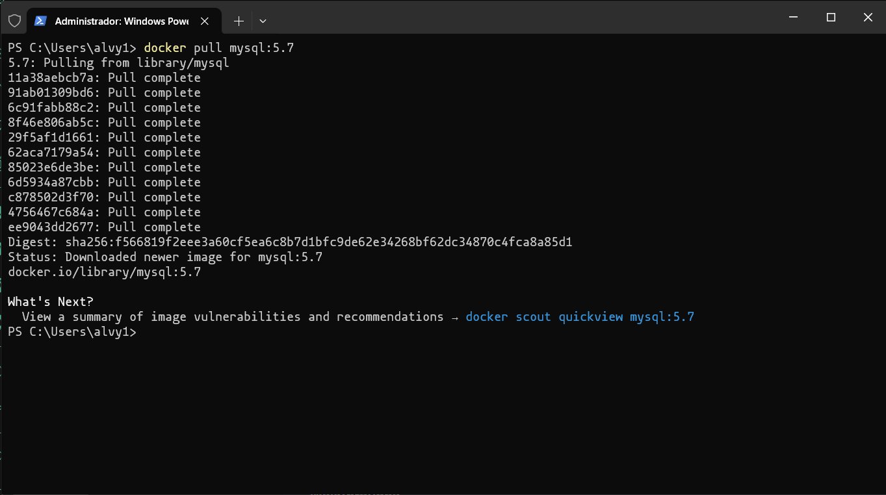

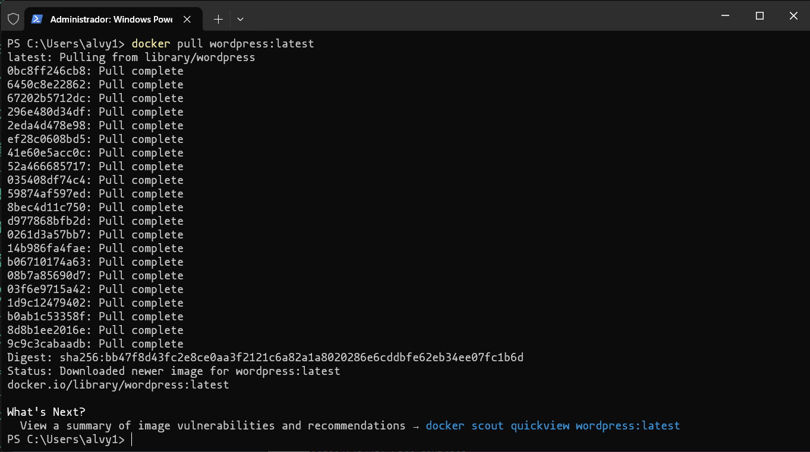


## docker-compose

Se ha configurado un `docker-compose` para definir la aplicación, para ello se ha creado un archivo `YAML` llamado docker-compose.yml.


```yaml
version: '3'

volumes:
  db:
  wordpress:


services:
  db:
    image: mysql:5.7
    restart: always
    environment:
      MYSQL_ROOT_PASSWORD: root
      MYSQL_DATABASE: wordpress
      MYSQL_USER: test
      MYSQL_PASSWORD: test
    ports:

   - "3306:3306"
     lumes:
        - db:/var/lib/mysql

  wordpress:
    depends_on:

   - db
     age: wordpress:latest
         restart: always
         ports:
        - "8080:80"
          vironment:
                WORDPRESS_DB_HOST: db:3306
                WORDPRESS_DB_USER: test
                WORDPRESS_DB_PASSWORD: test
                WORDPRESS_DB_NAME: wordpress
              volumes:
             - wordpress:/var/www/html
```

#### Servicios

Este docker-compose.yml, muestra los dos servicios que se van a desplegar, mysql como gestor de base de datos y wordpress para la aplicación web. 

#### Puertos

Se especifica que se emplearán los puertos "3306:3306" para mysql y "8080:80" para la web.

#### Dependencias

En el fragmento:

```yaml
 wordpress:
    depends_on:

   - db
```

Se indica que la aplicación de wordpress dependerá de la base de datos, esto hará que docker despliegue primero mysql, lo que evitará posibles errores. 


## Grupo de recursos

Lo principal para crear la aplicación es definir un grupo de recursos, para ello primero debe loguearse al usuario.

```powershell
az login
```

Y a continuación crear el grupo de recursos:

```powershell
az group create --name miGrupoRecursos --location "West Europe"
```

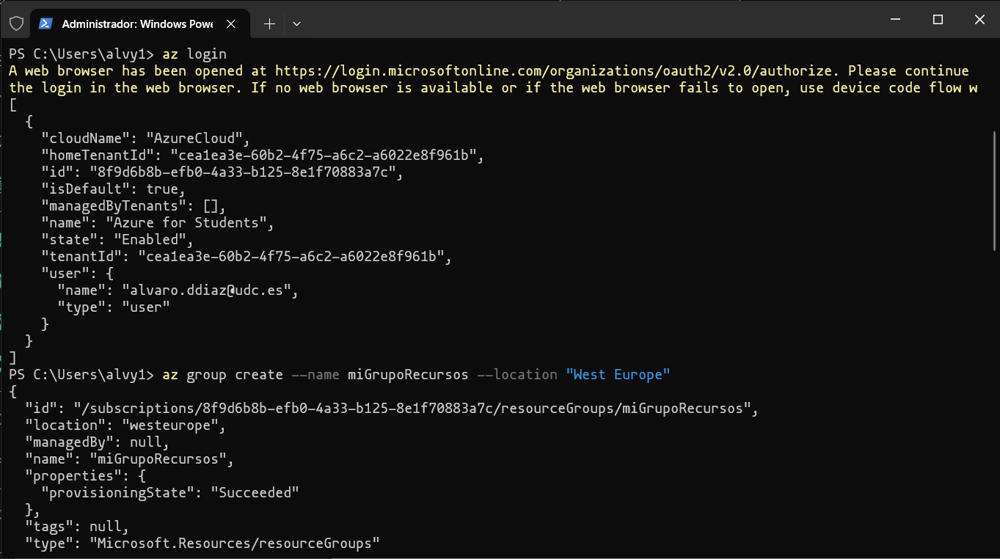


## Registro de contenedores

Para poder almacenar las imágenes docker en azure se debe crear un registro de contenedores.

```powershell
az acr create --name alvarodiazregistry --resource-group miGrupoRecursos --sku Basic
```

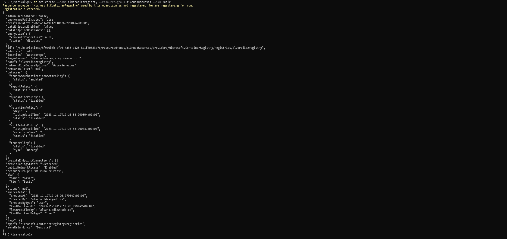


## Carga de las imágenes en el registro de contenedores

Se subirán ahora las imágenes docker al registro previamente creado, para permitir a la aplicación web acceder a las mismas.

Primero se debe hacer login en el registro de contenedores:

```powershell
az acr login --name alvarodiazregistry 
```

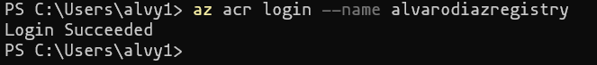


A continuación se procede a etiquetar a las imágenes con el nombre del registro de contenedores, para así indicar a docker a que registro subir las imágenes.

```powershell
docker tag mysql:5.7 alvarodiazregistry.azurecr.io/mysql:5.7
docker tag wordpress:latest alvarodiazregistry.azurecr.io/wordpress:latest 
```

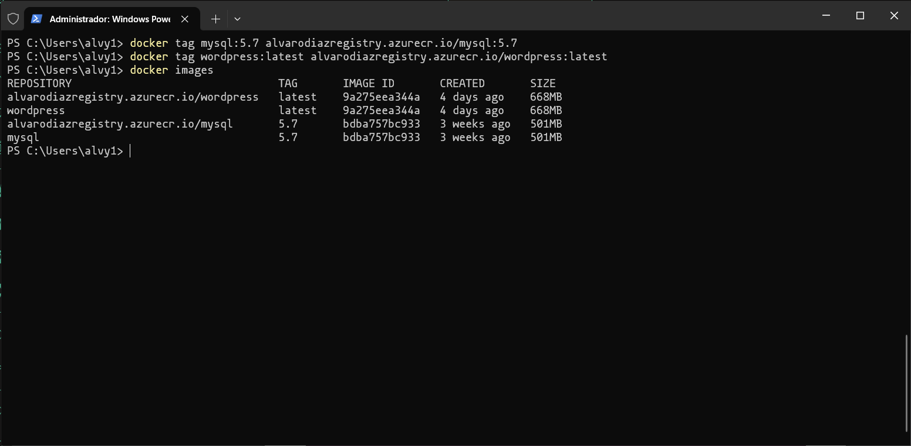


Una vez etiquetadas correctamente, se habilita el acceso como administrador en el registro.

```powershell
az acr update -n alvarodiazregistry --admin-enabled true
```

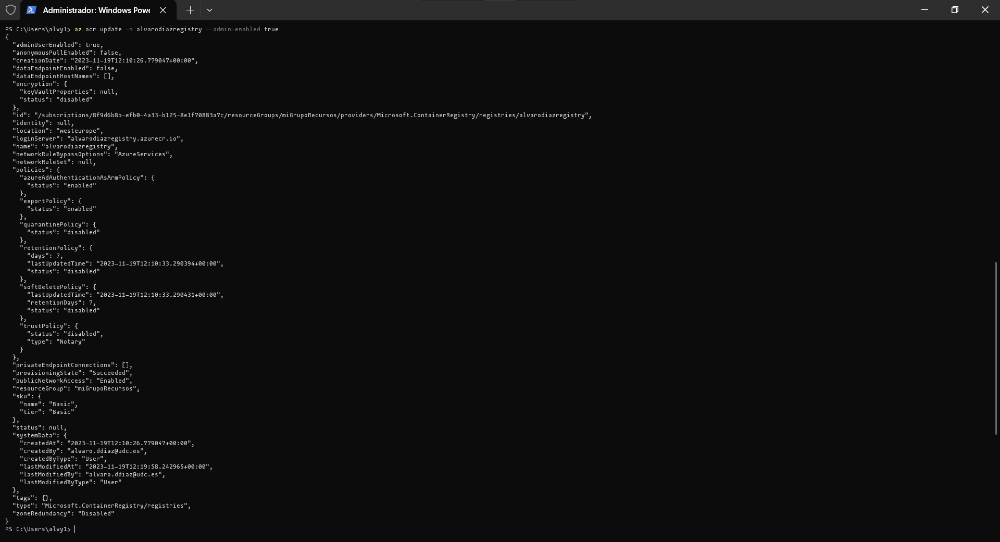


Para conocer las credenciales de `admin`, se debe acceder a la siguiente pantalla:
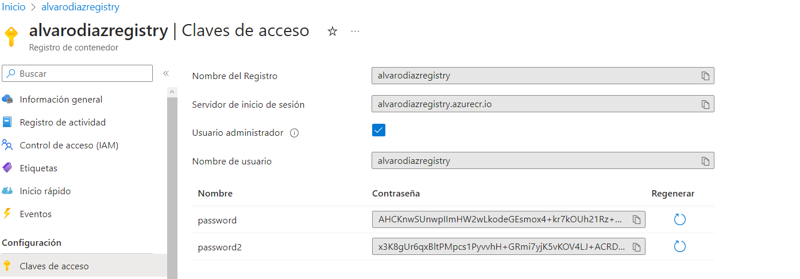


Con el acceso de administrador habilitado y las credenciales del mismo conocidas, se procede a iniciar sesión como tal.

```powershell
docker login alvarodiazregistry.azurecr.io	
```

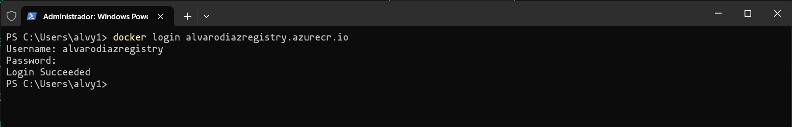


Finalmente, se podrán subir las imágenes al registro de contenedores de azure.

```powershell
docker push alvarodiazregistry.azurecr.io/mysql:5.7
docker push alvarodiazregistry.azurecr.io/wordpress:latest 
```

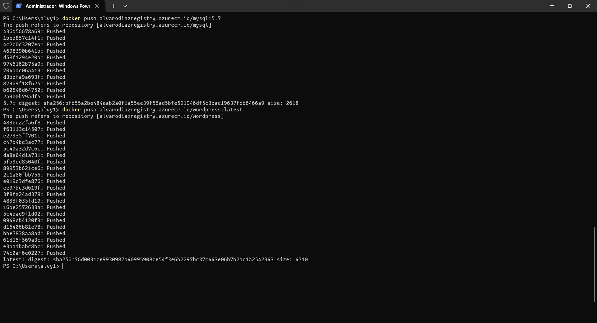


Se comprueba desde la web de azure la correcta subida de las imágenes:

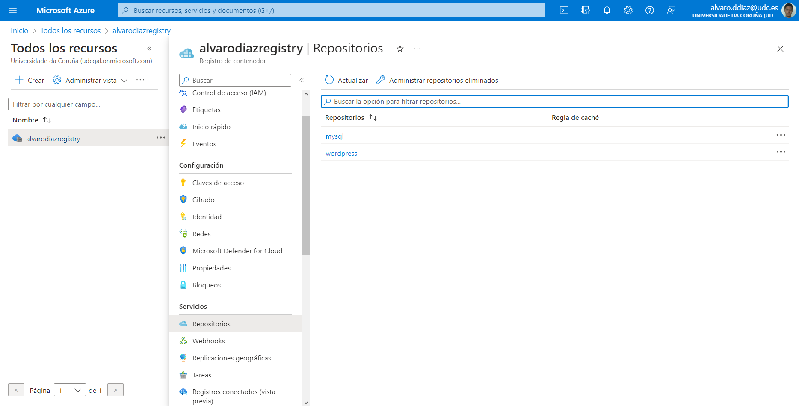


## App Service Plan

Para crear la aplicación, primero se debe configurar un plan para la misma.

```powershell
az appservice plan create --name alvarodiaz-appservice-plan --resourcegroup miGrupoRecursos --sku B1 --is-linux
```

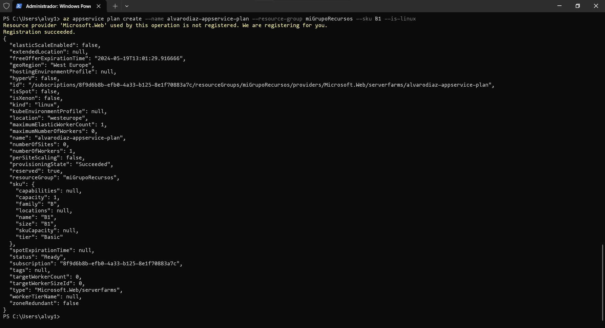


## Despliegue de la aplicación

Una vez creado el plan para la aplicación se procede a su despliegue.

```powershell
az webapp create --name AlvaroDiazWebApp --plan alvarodiazappservice-plan --resource-group miGrupoRecursos --multicontainer-configfile docker-compose.yml --multicontainer-config-type COMPOSE
```

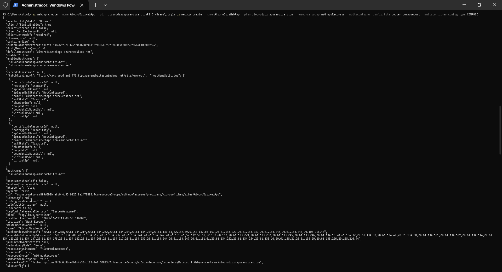

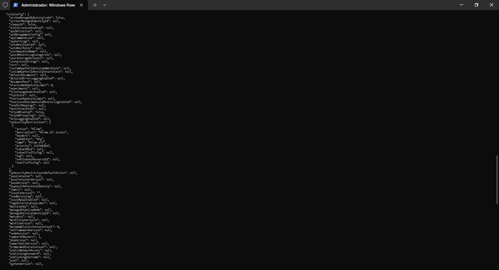

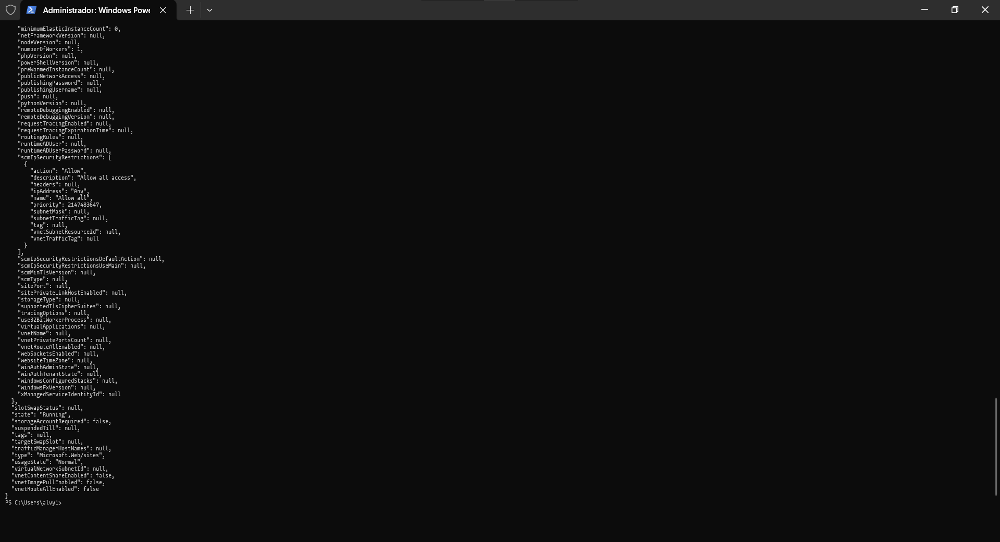


Para que la app acceda al registro de contenedores que se ha creado y no a DockerHub, se debe introducir la siguiente sentencia:

```powershell
az webapp config container set --name AlvaroDiazWebApp --resource-group miGrupoRecursos --docker-registry-server-url alvarodiazregistry.azurecr.io --docker-registry-server-user alvarodiazregistry --docker-registry-server-password AHCKnwSUnwpIImHW2wLkodeGEsmox4+kr7kOUh21Rz+ACRCJ1Uzo 
```

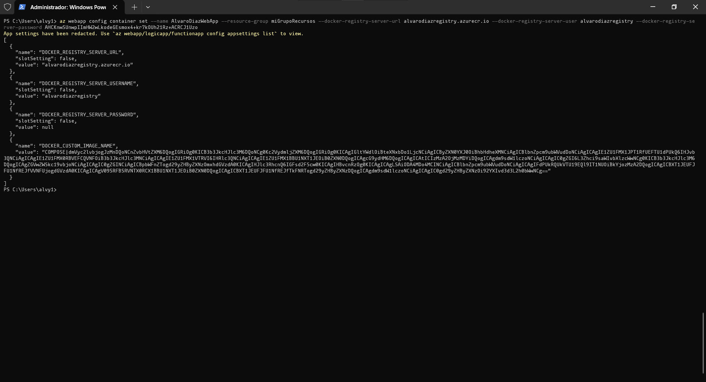


## Aplicación web

Ahora que la aplicación web se ha desplegado, se puede acceder a ella a través de la siguiente `url`:

http://alvarodiazwebapp.azurewebsites.net

Al ser la primera vez que se accede a la app, es necesario configurar e instalar wordpress desde la `url`:

http://alvarodiazwebapp.azurewebsites.net/wp-admin/install.php

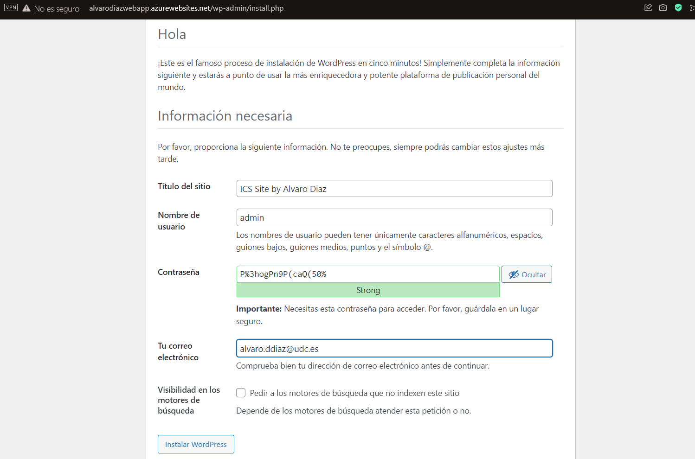


#### Vista principal

Se ha creado la nueva publicación "Mi primera entrada de blog!":

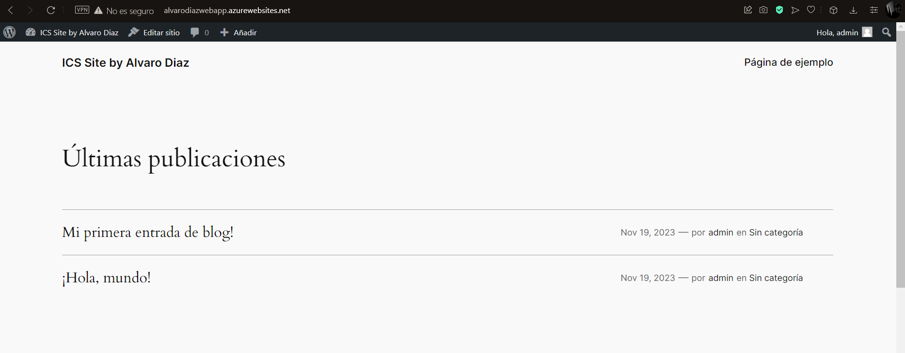


#### Vista publicación

Al entrar en la publicación, se pueden ver los comentarios, la fecha de publicación de la entrada y, si la tiene, la categoría.

 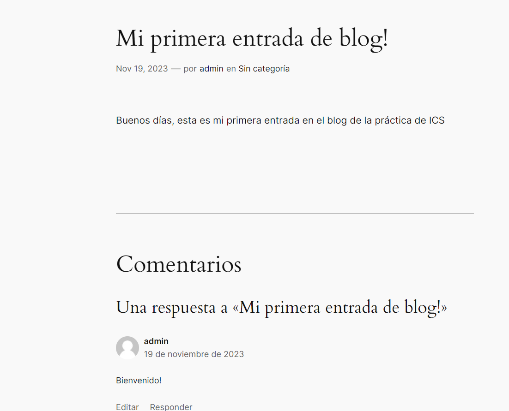
